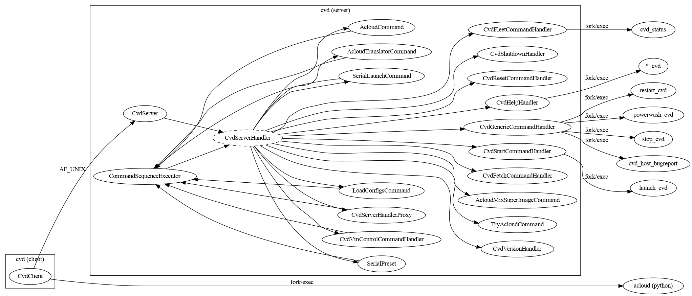
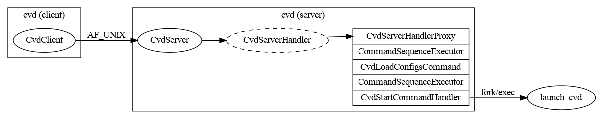

Frontend command line interface for Cuttlefish command-line tools.

Separated into a thin client and a persistent background server process that
tracks user state.

Requests are handled through a handler classes, which may delegate into other
handler classes through `CommandSequenceExecutor`.

A specific example of handlers delegating into other handlers to implement some
functionality:

