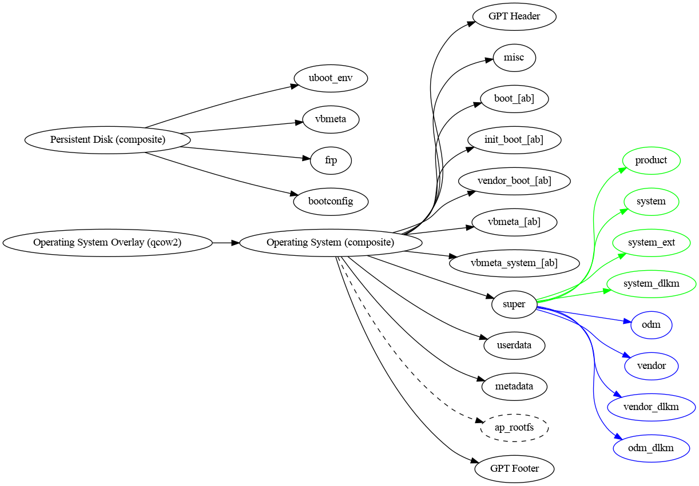

Host filesystem setup to prepare for running a Cuttlefish device.

Supports rewriting `super.img`, `boot.img`, and `initramfs.img` based on
`launch_cvd` arguments. In a multi-device configuration, there is only one
`assemble_cvd` invocation, but multiple `run_cvd` invocations, one per device.

The disk files produced by the Android build system are arranged into a
"[composite disk]" and protected with a read-on-write [qcow2] overlay.

[composite disk]: https://chromium.googlesource.com/chromiumos/platform/crosvm/+/refs/heads/main/disk/src/composite.rs
[qcow2]: https://en.wikipedia.org/wiki/Qcow
