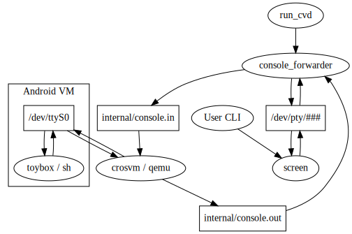

_This page is best viewed on [codesearch]._

Console pass-through to the serial console on a device to access a root shell.

If a user invokes `launch_cvd --console` or `cvd start --console`, this
executable runs to forward data from a serial console to a virtual terminal
that can be accessed with `screen` from the host.

[codesearch]: https://cs.android.com/android/platform/superproject/+/master:device/google/cuttlefish/host/commands/console_forwarder/README.md
