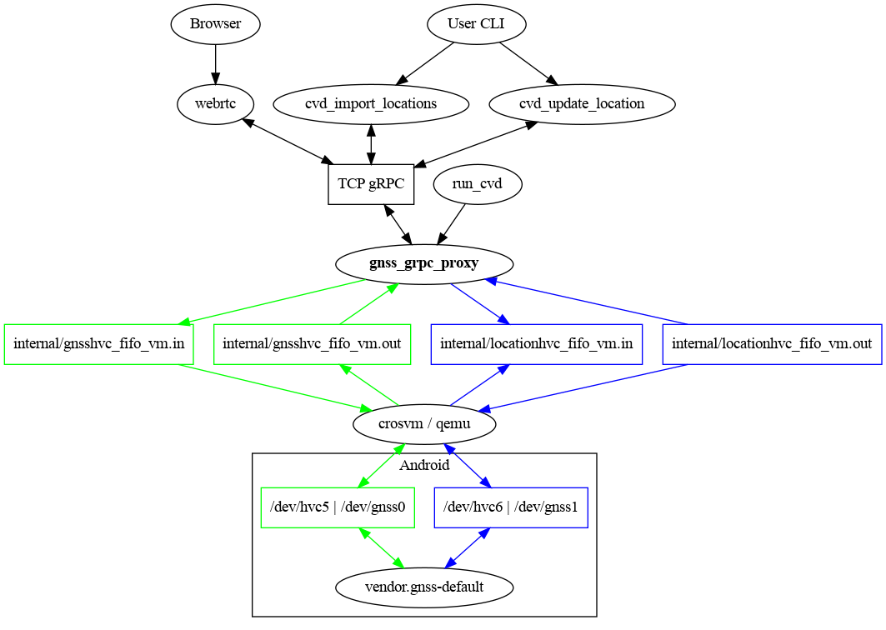

Virtual device location data manager serving a gRPC interface.

The [`cvd_import_locations`] and [`cvd_update_location`] executables are
clients that use this service to set either a sequence of locations or a new
fixed location for the device.

[`cvd_import_locations`]: https://cs.android.com/android/platform/superproject/+/master:device/google/cuttlefish/host/commands/cvd_import_locations/
[`cvd_update_location`]: https://cs.android.com/android/platform/superproject/+/master:device/google/cuttlefish/host/commands/cvd_update_location/
