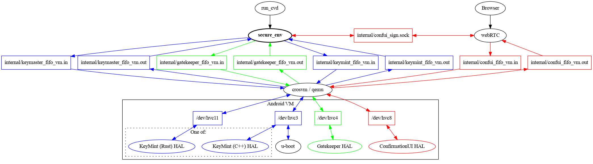

Host process substituting for a TEE (Trusted Execution Environment). Used to
run backing implementations of Android HALs that normally delegate to a TEE
environment, specifically ConfirmationUI, Gatekeeper, and Keymint.

Gatekeeper and Keymint communicate with `secure_env` through virtio-console
channels connected to FIFO files on the host. The display part of
ConfirmationUI is runs in the `webRTC` host process, which delegates signing
operations only to `secure_env`.

Before entering the kernel, the u-boot bootloader writes some information
about the device image files into the keymint channel to prepare it with
the authenticated version number of the operating system.

