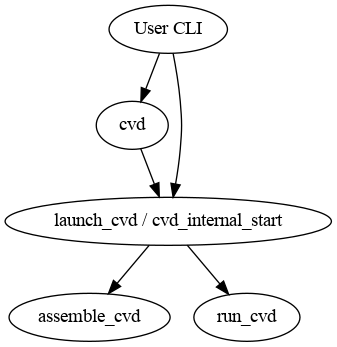

Entry point to launching one or more Cuttlefish virtual devices.
`cvd_internal_start` invokes `assemble_cvd` once to set up all devices, and
then invokes `run_cvd` once per device. Arguments / flags are passed through to
`assemble_cvd` and `run_cvd`.

The `cvd_internal_start` executable used to be named `launch_cvd`, and is still
referred to as `launch_cvd` in some places.

