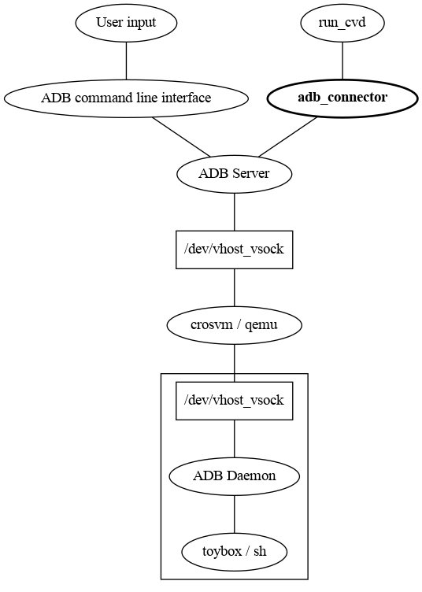

Manages state in the adb server pertaining to a Cuttlefish device. The ADB
server does not automatically discover Cuttlefish devices, so this process
sends register and deregister messages to the ADB server to inform it of
the device state.

